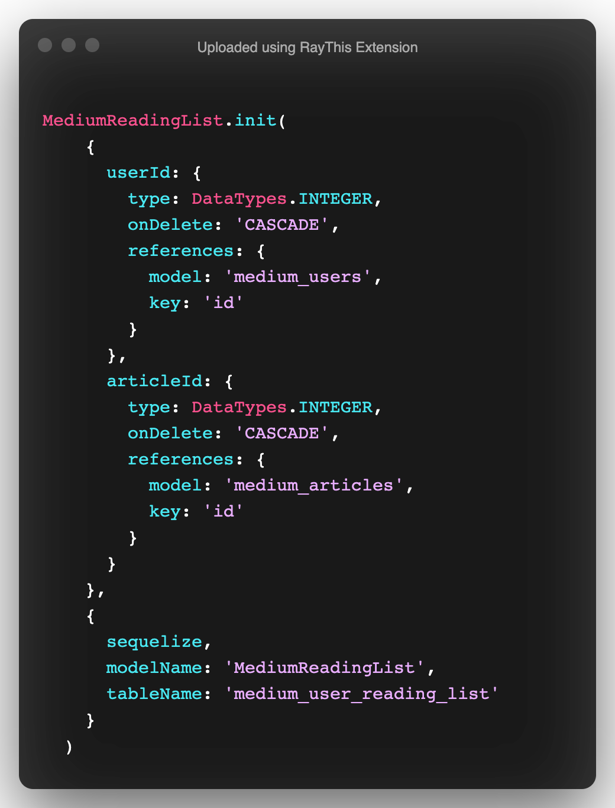

# Sequelize Complex Associations


## Overview

In this lesson, we'll be covering how to incorporate many-many relationships with Sequelize. Many-Many relationships are an important feature of relational databases that allow us to associate data to many records in our database.

## Getting Started

- Fork and Clone
- `npm run setup` => This command will set up both applications for you.

## What are Many-Many Relationships

Many-Many relationships are a representation of multiple owners for a given record. For example, many users can save the same article to their library.

Another example would be Github:

- Repos belongsToMany Users `through` Orgs

Notice the `through` keyword. By default we cannot define a many-many relationship all by itelf. We need to use a `through` or `join` table to store those references. We'll learn how to set these up in the next step.

## Medium Clone

We'll start by building a small Medium clone to help us understand how a many-many relationship is set up and implemented.

Take a look at the following ERD, can you identify the `join` table?


<details closed>
<summary>Heres a hint</summary>
<code>user_reading_list</code>
</details>

If you've made it this far, the `user_reading_list` table is the representation of our `join` table! We'll store the `userId` and the `articleId` in this table to keep a record of which user has added an article to their reading list.

In this example, multiple users have ownership of an article via the `join` table.

### Implementing The Code

Head over to the `medium_clone` folder. Let's take a look at the provided models.

You'll notice we have three:

- `MediumArticle`
- `MediumReadingList`
- `MediumUser`

Let's take a look at the `MediumReadingList` model:



You'll notice that there are two `foreign keys` declared here:

- `userId`
- `articleId`

The `userId` is a reference to the `medium_users` table.
The `articleId` is a reference to the `medium_articles` table.

However, just because we have the `foreign keys` does not mean that our relationship is set up.

To do this we'll need to update our `MediumUser` and `MediumArticle` models.

Head over to the `MediumUser` model. Here we'll declare the association.

Add the following code to the `associate` method:

```js
MediumUser.belongsToMany(models.MediumArticle, {
  as: 'reading_list',
  through: models.MediumReadingList,
  foreignKey: 'userId'
})
```

Let's break this down, we're using the `belongsToMany` method to define a `many-many` relationship betweeen the `User` and `Article`.

As options, we utilize the `as` keyword to `alias` the retrieved data.

**Note**: This is required when defining many-many relationships.

We then pass a `through` option. This option should reference your `join` table.

And finally we declare which foreign key to use to load the assoiciated data.

### Implementing The Article Association

Head over to the `MediumArticle` model, we'll define our many-many relationship here as well:

```js
MediumArticle.belongsToMany(models.MediumUser, {
  through: models.MediumReadingList,
  as: 'articles',
  foreignKey: 'articleId'
})
```

Notice here that our `alias` is different. These aliases are used to identify the incoming data.

## Recap

## Resources
